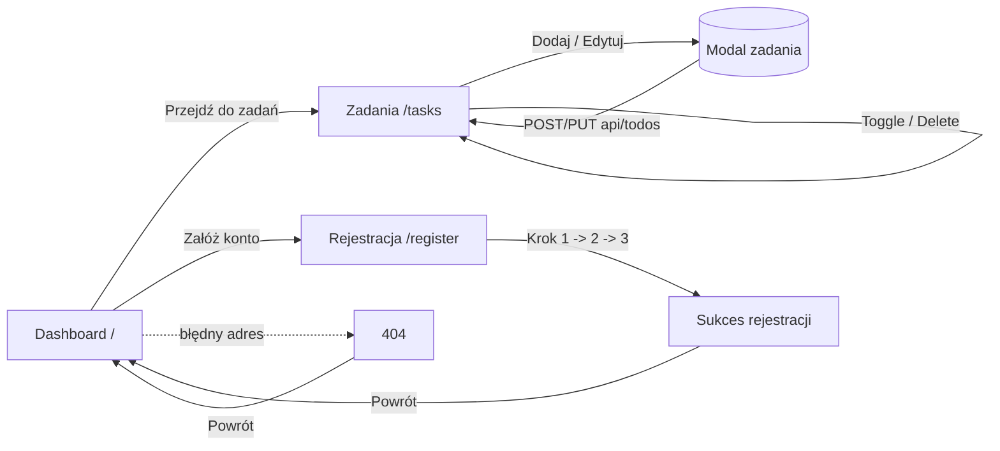

# TaskFlow — Menedżer zadań To-Do

Nowoczesna, dostępna i responsywna aplikacja do zarządzania zadaniami (To-Do / Task Manager), zbudowana w React + TypeScript. Projekt zaliczeniowy z przedmiotu **Zaawansowany Interfejs Użytkownika (ZIU)**.

> **Kluczowe pytanie projektu:** _Czy aplikacja działa i czy użytkownik może z niej skorzystać samodzielnie?_ — Tak. Aplikacja jest w pełni funkcjonalna, działa po wdrożeniu publicznym i nie wymaga żadnej konfiguracji od użytkownika końcowego (mockowane API uruchamia się automatycznie w przeglądarce).

---

## Spis treści

- [Demo](#-demo)
- [Najważniejsze funkcje](#-najważniejsze-funkcje)
- [Stos technologiczny](#-stos-technologiczny)
- [Uruchomienie lokalne](#-uruchomienie-lokalne)
- [Struktura projektu](#-struktura-projektu)
- [Architektura: stan, API i mock](#-architektura-stan-api-i-mock)
- [Dostępność (WCAG)](#-dostępność-wcag)
- [Przepływ użytkownika (user flow)](#-przepływ-użytkownika-user-flow)
- [Prototypowanie](#-prototypowanie)
- [Wdrożenie (deployment)](#-wdrożenie-deployment)
- [Notatka UX](#-notatka-ux)

---

## Demo

- **Aplikacja na żywo:** _[➡️ wklej tutaj link do wdrożenia, np. https://twoj-login.github.io/Zaawansowany-interfejs-uzytkownika-36346/ ]_
- **Repozytorium:** https://github.com/iQuosIT/Zaawansowany-interfejs-uzytkownika-36346

> Po wdrożeniu (patrz sekcja [Wdrożenie](#-wdrożenie-deployment)) wstaw powyżej działający adres URL.

---

## Najważniejsze funkcje

| Obszar | Realizacja w aplikacji |
| --- | --- |
| **Komponenty wielokrotnego użytku** | `TodoList`, `FilterBar`, `AddTaskModal`, `StatsCard`, `PageTransition`, `Layout`, kroki formularza (`Step1–3`) itd. |
| **Routing (7 ekranów)** | React Router: Dashboard (`/`), Zadania (`/tasks`), Logowanie (`/login`), Rejestracja (`/register`), Mój profil (`/profile`), Ustawienia (`/settings`), strona 404 (`*`). |
| **Motyw jasny/ciemny** | Przełączany w Ustawieniach oraz szybkim przyciskiem w nagłówku; wybór koloru akcentu; zapis preferencji w `localStorage`. |
| **Wielojęzyczność (i18n)** | Pełne tłumaczenie interfejsu PL/EN (własny lekki słownik + `t()`), z aktualizacją atrybutu `<html lang>`. |
| **Profil użytkownika** | Edytowalna nazwa (RHF + Zod), awatar z inicjałami, statystyki konta (liczba zadań, ukończone, wskaźnik ukończenia). |
| **Biblioteka UI** | Material UI (MUI) + ikony + MUI Lab (Timeline). |
| **Responsywność** | Layout płynny (CSS Grid `auto-fit` + `clamp()`), breakpointy MUI (`xs/sm/md`), mobilny `Drawer`. |
| **Formularze + walidacja** | React Hook Form + Zod (rejestracja wieloetapowa oraz formularz zadania), czytelne komunikaty błędów. |
| **Stan globalny** | Context API + `useReducer` (`TodoContext`, `FeedbackContext`, `AuthContext`, `SettingsContext`). |
| **Stany async** | `loading` (spinnery), `success` (snackbar), `error` (alert + przycisk „Spróbuj ponownie”). |
| **API / mock** | Mock Service Worker (MSW) — pełny REST: `GET`, `POST`, `PUT`, `DELETE` z trwałością w `localStorage`. |
| **Obsługa błędów sieci** | Widoczny alert błędu + przełącznik „Symuluj błąd sieci” do demonstracji. |
| **Animacje** | Framer Motion — przejścia między widokami, animowana lista zadań, mikrointerakcje. |
| **Dostępność** | Semantyczny HTML, `aria-*`, skip link, widoczny fokus, `prefers-reduced-motion`. |

---

## Stos technologiczny

- **React 18** + **TypeScript**
- **Vite 5** (bundler / dev server)
- **Material UI (MUI) 7** + **@mui/lab** + **@mui/icons-material**
- **React Router 6** (`HashRouter` — działa na każdym hostingu statycznym)
- **React Hook Form 7** + **Zod 4** (walidacja)
- **Framer Motion 11** (animacje)
- **MSW (Mock Service Worker) 2** (mockowane API REST)
- **Tailwind CSS 3** (uzupełniające style formularza rejestracji)

---

## Uruchomienie lokalne

Wymagania: **Node.js ≥ 18** i **npm**.

```bash
# 1. Sklonuj repozytorium
git clone https://github.com/iQuosIT/Zaawansowany-interfejs-uzytkownika-36346.git
cd Zaawansowany-interfejs-uzytkownika-36346

# 2. Zainstaluj zależności
npm install

# 3. Uruchom serwer deweloperski
npm run dev
```

Aplikacja będzie dostępna pod adresem `http://localhost:3000` (lub kolejnym wolnym portem).

Inne polecenia:

```bash
npm run build     # produkcyjny build (TypeScript + Vite) -> katalog dist/
npm run preview   # podgląd builda produkcyjnego
npm run lint      # statyczna analiza kodu
npm run deploy    # publikacja na GitHub Pages
```

---

## Struktura projektu

```
src/
├── api/                # Warstwa klienta API (fetch + obsługa błędów)
│   └── todoApi.ts
├── components/
│   ├── auth/           # Wieloetapowy formularz rejestracji (RHF + Zod)
│   ├── common/         # SkipLink, PageTransition
│   ├── dashboard/      # AppHeader, ProjectCards, StatsGrid, RecentTasks, AddTaskModal
│   ├── layout/         # Layout (nagłówek + nawigacja + stopka + <Outlet/>)
│   ├── FilterBar.tsx
│   └── TodoList.tsx
├── context/            # Stan globalny (TodoContext, FeedbackContext)
├── mocks/              # MSW: handlery REST + trwałość w localStorage
├── pages/              # Widoki: Dashboard, Tasks, Register, NotFound
├── reducers/           # todoReducer (loading/success/error)
├── theme/              # Motyw MUI (dark mode)
└── types/              # Typy TypeScript
```

---

## Architektura: stan, API i mock

### Stan globalny
`TodoContext` (Context API + `useReducer`) przechowuje listę zadań oraz status żądań
(`idle | loading | success | error`). `FeedbackContext` udostępnia globalne powiadomienia
(snackbar) o sukcesie/błędzie.

### Mockowane API (MSW)
Aplikacja wykonuje **prawdziwe żądania `fetch`** do `/api/todos`, które są przechwytywane
przez Service Worker (MSW). Dzięki temu w zakładce **Network** w narzędziach deweloperskich
widać realne zapytania HTTP, a dane są trwale zapisywane w `localStorage`:

| Metoda | Endpoint | Opis |
| --- | --- | --- |
| `GET` | `/api/todos` | Pobranie listy zadań |
| `POST` | `/api/todos` | Dodanie nowego zadania |
| `PUT` | `/api/todos/:id` | Aktualizacja (ukończenie / edycja tytułu) |
| `DELETE` | `/api/todos/:id` | Usunięcie zadania |

Każde żądanie ma sztuczne opóźnienie (~600 ms), aby zaprezentować stany ładowania.
Przełącznik **„Symuluj błąd sieci”** w oknie dodawania zadania zwraca odpowiedź `500`,
co pozwala zobaczyć obsługę błędów (alert + przycisk „Spróbuj ponownie”).

---

## Dostępność (WCAG)

- **Semantyczny HTML i ARIA:** `header`, `main`, `nav`, `footer`, `section[aria-labelledby]`, `role="alert"`, `aria-live`, `aria-current`, `aria-busy`, opisowe `aria-label` na przyciskach akcji.
- **Skip link** („Przejdź do treści głównej”) dla użytkowników klawiatury.
- **Widoczny fokus** (`:focus-visible`) na wszystkich elementach interaktywnych.
- **Nawigacja klawiaturą** — pełna obsługa (formularze, modale z focus-trap MUI, menu).
- **Kontrast kolorów** zgodny z poziomem AA (motyw ciemny z jasnym tekstem).
- **`prefers-reduced-motion`** — animacje są wyłączane dla użytkowników preferujących ograniczony ruch.

### Audyt
Aplikację można zweryfikować w **Lighthouse** (DevTools → Lighthouse → Accessibility)
lub rozszerzeniem **AXE DevTools**. Celem jest brak błędów krytycznych.

---

## Przepływ użytkownika (user flow)



---

## Prototypowanie

Proces projektowy przebiegał od szkiców lo-fi, przez makietę hi-fi, aż do implementacji:

1. **Lo-fi** — szkice/wireframes układu (hero, karty projektów, lista zadań, formularz rejestracji).
2. **Hi-fi** — makieta z docelową kolorystyką (ciemny motyw, niebieski akcent `#3B82F6`) i przepływem ekranów (patrz diagram powyżej).
3. **Spójność** — finalna implementacja odwzorowuje makietę (typografia, odstępy `clamp()`, komponenty MUI, paleta kolorów zdefiniowana w `src/theme/muiTheme.ts`).

> Pliki prototypów (Figma / obrazy wireframe) dołącz do repozytorium w katalogu `docs/`
> lub wstaw tutaj link do projektu Figma.

---

## Wdrożenie (deployment)

Aplikacja korzysta z `HashRouter` i ścieżek względnych (`base: './'`), dzięki czemu działa
na **dowolnym hostingu statycznym bez dodatkowej konfiguracji przekierowań**.

### Opcja A — GitHub Pages (jedna komenda)

```bash
npm run deploy
```

Polecenie zbuduje aplikację i opublikuje katalog `dist/` na gałęzi `gh-pages`.
Następnie w ustawieniach repozytorium (**Settings → Pages**) wybierz źródło: gałąź `gh-pages`.
Adres będzie miał postać: `https://<login>.github.io/Zaawansowany-interfejs-uzytkownika-36346/`.

### Opcja B — Vercel

1. Zaimportuj repozytorium na [vercel.com](https://vercel.com).
2. Vercel automatycznie wykryje Vite (konfiguracja w `vercel.json`).
3. Kliknij **Deploy**.

### Opcja C — Netlify

1. Połącz repozytorium na [netlify.com](https://netlify.com).
2. Build command: `npm run build`, Publish directory: `dist` (gotowe w `netlify.toml`).

---

## Notatka UX

### Grupa docelowa / persona

> **Ania, 24 lata, studentka i freelancerka.** Codziennie żongluje obowiązkami na uczelni
> i drobnymi zleceniami. Korzysta głównie z telefonu, ceni szybkość i przejrzystość.
> Potrzebuje narzędzia, w którym w kilka sekund doda zadanie, oznaczy je jako zrobione
> i będzie widzieć postęp — bez logowania i zbędnych kroków.

### Zasady projektowania zorientowanego na użytkownika (UCD)

- **Niski próg wejścia** — aplikacja działa od razu, bez rejestracji i konfiguracji (rejestracja jest opcjonalną demonstracją formularzy).
- **Mobile-first** — układ i nawigacja zaprojektowane pod ekrany dotykowe (cele dotykowe ≥ 44 px, mobilny drawer).
- **Natychmiastowa informacja zwrotna** — każda akcja kończy się widocznym potwierdzeniem (snackbar) lub komunikatem błędu.

### Odniesienie do heurystyk Nielsena

1. **Widoczność statusu systemu** — spinnery (ładowanie), snackbary (sukces/błąd), wskaźnik „Synchronizacja…”, liczniki statystyk.
2. **Dopasowanie do świata rzeczywistego** — język polski, zrozumiałe etykiety („Dodaj zadanie”, „Priorytet: Wysoki”).
3. **Kontrola i swoboda użytkownika** — przyciski „Anuluj”/„Wstecz”, możliwość edycji i usuwania zadań, wyjście ze strony 404.
4. **Zapobieganie błędom** — walidacja formularzy (Zod) blokuje błędne dane, przycisk wysyłki jest zablokowany w trakcie zapisu.
5. **Rozpoznawanie zamiast przypominania** — wyraźne ikony akcji (edycja/usuwanie), filtry stanu, podsumowanie danych przed rejestracją.
6. **Estetyka i minimalizm** — spójny ciemny motyw, czytelna hierarchia, brak zbędnych elementów.
7. **Pomoc w rozpoznaniu i naprawie błędów** — komunikaty błędów są opisowe i wskazują rozwiązanie („Spróbuj ponownie”).
8. **Elastyczność i wydajność** — wyszukiwarka i filtry zadań, skróty (Enter w formularzu), skip link dla zaawansowanych.

---

_Projekt zaliczeniowy — Zaawansowany Interfejs Użytkownika, 2026._
