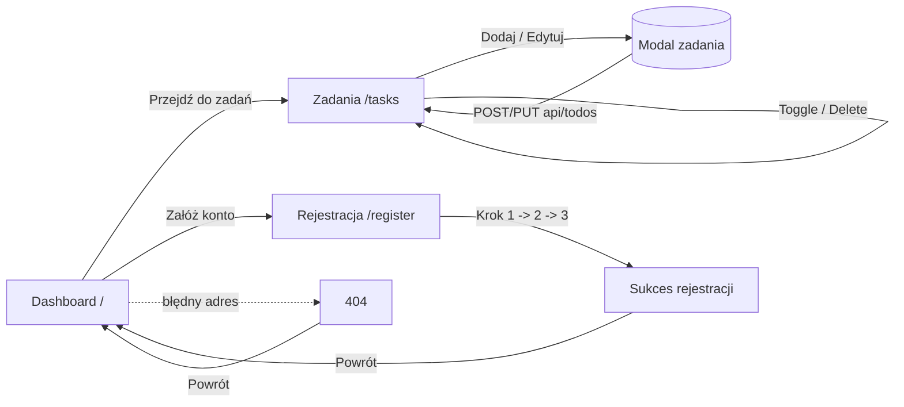

# TaskFlow — Menedżer zadań To-Do

Nowoczesna, dostępna i responsywna aplikacja do zarządzania zadaniami (To-Do / Task Manager), zbudowana w React + TypeScript. Projekt zaliczeniowy z przedmiotu **Zaawansowany Interfejs Użytkownika (ZIU)**.

> **Kluczowe pytanie projektu:** _Czy aplikacja działa i czy użytkownik może z niej skorzystać samodzielnie?_ — Tak. Aplikacja jest w pełni funkcjonalna, działa po wdrożeniu publicznym i nie wymaga żadnej konfiguracji od użytkownika końcowego (mockowane API uruchamia się automatycznie w przeglądarce).

---

## Spis treści

- [Demo](#-demo)
- [Najważniejsze funkcje](#-najważniejsze-funkcje)
- [Stos technologiczny](#-stos-technologiczny)
- [Uruchomienie lokalne](#-uruchomienie-lokalne)
- [Struktura projektu](#-struktura-projektu)
- [Architektura: stan, API i mock](#-architektura-stan-api-i-mock)
- [Dostępność (WCAG)](#-dostępność-wcag)
- [Przepływ użytkownika (user flow)](#-przepływ-użytkownika-user-flow)
- [Prototypowanie](#-prototypowanie)
- [Wdrożenie (deployment)](#-wdrożenie-deployment)
- [Notatka UX](#-notatka-ux)

---

## Demo

- **Aplikacja na żywo:** _[➡️ wklej tutaj link do wdrożenia, np. https://twoj-login.github.io/Zaawansowany-interfejs-uzytkownika-36346/ ]_
- **Repozytorium:** https://github.com/iQuosIT/Zaawansowany-interfejs-uzytkownika-36346

> Po wdrożeniu (patrz sekcja [Wdrożenie](#-wdrożenie-deployment)) wstaw powyżej działający adres URL.

---

## Najważniejsze funkcje

| Obszar | Realizacja w aplikacji |
| --- | --- |
| **Komponenty wielokrotnego użytku** | `TodoList`, `FilterBar`, `AddTaskModal`, `StatsCard`, `PageTransition`, `Layout`, kroki formularza (`Step1–3`) itd. |
| **Routing (7 ekranów)** | React Router: Dashboard (`/`), Zadania (`/tasks`), Logowanie (`/login`), Rejestracja (`/register`), Mój profil (`/profile`), Ustawienia (`/settings`), strona 404 (`*`). |
| **Motyw jasny/ciemny** | Przełączany w Ustawieniach oraz szybkim przyciskiem w nagłówku; wybór koloru akcentu; zapis preferencji w `localStorage`. |
| **Wielojęzyczność (i18n)** | Pełne tłumaczenie interfejsu PL/EN (własny lekki słownik + `t()`), z aktualizacją atrybutu `<html lang>`. |
| **Profil użytkownika** | Edytowalna nazwa (RHF + Zod), awatar z inicjałami, statystyki konta (liczba zadań, ukończone, wskaźnik ukończenia). |
| **Biblioteka UI** | Material UI (MUI) + ikony + MUI Lab (Timeline). |
| **Responsywność** | Layout płynny (CSS Grid `auto-fit` + `clamp()`), breakpointy MUI (`xs/sm/md`), mobilny `Drawer`. |
| **Formularze + walidacja** | React Hook Form + Zod (rejestracja wieloetapowa oraz formularz zadania), czytelne komunikaty błędów. |
| **Stan globalny** | Context API + `useReducer` (`TodoContext`, `FeedbackContext`, `AuthContext`, `SettingsContext`). |
| **Stany async** | `loading` (spinnery), `success` (snackbar), `error` (alert + przycisk „Spróbuj ponownie”). |
| **API / mock** | Mock Service Worker (MSW) — pełny REST: `GET`, `POST`, `PUT`, `DELETE` z trwałością w `localStorage`. |
| **Obsługa błędów sieci** | Widoczny alert błędu + przełącznik „Symuluj błąd sieci” do demonstracji. |
| **Animacje** | Framer Motion — przejścia między widokami, animowana lista zadań, mikrointerakcje. |
| **Dostępność** | Semantyczny HTML, `aria-*`, skip link, widoczny fokus, `prefers-reduced-motion`. |

---

## Stos technologiczny

- **React 18** + **TypeScript**
- **Vite 5** (bundler / dev server)
- **Material UI (MUI) 7** + **@mui/lab** + **@mui/icons-material**
- **React Router 6** (`HashRouter` — działa na każdym hostingu statycznym)
- **React Hook Form 7** + **Zod 4** (walidacja)
- **Framer Motion 11** (animacje)
- **MSW (Mock Service Worker) 2** (mockowane API REST)
- **Tailwind CSS 3** (uzupełniające style formularza rejestracji)

---

## Uruchomienie lokalne

Wymagania: **Node.js ≥ 18** i **npm**.

```bash
# 1. Sklonuj repozytorium
git clone https://github.com/iQuosIT/Zaawansowany-interfejs-uzytkownika-36346.git
cd Zaawansowany-interfejs-uzytkownika-36346

# 2. Zainstaluj zależności
npm install

# 3. Uruchom serwer deweloperski
npm run dev
```

Aplikacja będzie dostępna pod adresem `http://localhost:3000` (lub kolejnym wolnym portem).

Inne polecenia:

```bash
npm run build     # produkcyjny build (TypeScript + Vite) -> katalog dist/
npm run preview   # podgląd builda produkcyjnego
npm run lint      # statyczna analiza kodu
npm run deploy    # publikacja na GitHub Pages
```

---

## Struktura projektu

```
src/
├── api/                # Warstwa klienta API (fetch + obsługa błędów)
│   └── todoApi.ts
├── components/
│   ├── auth/           # Wieloetapowy formularz rejestracji (RHF + Zod)
│   ├── common/         # SkipLink, PageTransition
│   ├── dashboard/      # AppHeader, ProjectCards, StatsGrid, RecentTasks, AddTaskModal
│   ├── layout/         # Layout (nagłówek + nawigacja + stopka + <Outlet/>)
│   ├── FilterBar.tsx
│   └── TodoList.tsx
├── context/            # Stan globalny (TodoContext, FeedbackContext)
├── mocks/              # MSW: handlery REST + trwałość w localStorage
├── pages/              # Widoki: Dashboard, Tasks, Register, NotFound
├── reducers/           # todoReducer (loading/success/error)
├── theme/              # Motyw MUI (dark mode)
└── types/              # Typy TypeScript
```

---

## Architektura: stan, API i mock

### Stan globalny
`TodoContext` (Context API + `useReducer`) przechowuje listę zadań oraz status żądań
(`idle | loading | success | error`). `FeedbackContext` udostępnia globalne powiadomienia
(snackbar) o sukcesie/błędzie.

### Mockowane API (MSW)
Aplikacja wykonuje **prawdziwe żądania `fetch`** do `/api/todos`, które są przechwytywane
przez Service Worker (MSW). Dzięki temu w zakładce **Network** w narzędziach deweloperskich
widać realne zapytania HTTP, a dane są trwale zapisywane w `localStorage`:

| Metoda | Endpoint | Opis |
| --- | --- | --- |
| `GET` | `/api/todos` | Pobranie listy zadań |
| `POST` | `/api/todos` | Dodanie nowego zadania |
| `PUT` | `/api/todos/:id` | Aktualizacja (ukończenie / edycja tytułu) |
| `DELETE` | `/api/todos/:id` | Usunięcie zadania |

Każde żądanie ma sztuczne opóźnienie (~600 ms), aby zaprezentować stany ładowania.
Przełącznik **„Symuluj błąd sieci”** w oknie dodawania zadania zwraca odpowiedź `500`,
co pozwala zobaczyć obsługę błędów (alert + przycisk „Spróbuj ponownie”).

---

## Dostępność (WCAG)

- **Semantyczny HTML i ARIA:** `header`, `main`, `nav`, `footer`, `section[aria-labelledby]`, `role="alert"`, `aria-live`, `aria-current`, `aria-busy`, opisowe `aria-label` na przyciskach akcji.
- **Skip link** („Przejdź do treści głównej”) dla użytkowników klawiatury.
- **Widoczny fokus** (`:focus-visible`) na wszystkich elementach interaktywnych.
- **Nawigacja klawiaturą** — pełna obsługa (formularze, modale z focus-trap MUI, menu).
- **Kontrast kolorów** zgodny z poziomem AA (motyw ciemny z jasnym tekstem).
- **`prefers-reduced-motion`** — animacje są wyłączane dla użytkowników preferujących ograniczony ruch.

### Audyt
Aplikację można zweryfikować w **Lighthouse** (DevTools → Lighthouse → Accessibility)
lub rozszerzeniem **AXE DevTools**. Celem jest brak błędów krytycznych.

---

## Przepływ użytkownika (user flow)



---

## Prototypowanie

Proces projektowy przebiegał od szkiców lo-fi, przez makietę hi-fi, aż do implementacji:

1. **Lo-fi** — szkice/wireframes układu (hero, karty projektów, lista zadań, formularz rejestracji).
2. **Hi-fi** — makieta z docelową kolorystyką (ciemny motyw, niebieski akcent `#3B82F6`) i przepływem ekranów (patrz diagram powyżej).
3. **Spójność** — finalna implementacja odwzorowuje makietę (typografia, odstępy `clamp()`, komponenty MUI, paleta kolorów zdefiniowana w `src/theme/muiTheme.ts`).

> Pliki prototypów (Figma / obrazy wireframe) dołącz do repozytorium w katalogu `docs/`
> lub wstaw tutaj link do projektu Figma.

---

## Wdrożenie (deployment)

Aplikacja korzysta z `HashRouter` i ścieżek względnych (`base: './'`), dzięki czemu działa
na **dowolnym hostingu statycznym bez dodatkowej konfiguracji przekierowań**.

### Opcja A — GitHub Pages (jedna komenda)

```bash
npm run deploy
```

Polecenie zbuduje aplikację i opublikuje katalog `dist/` na gałęzi `gh-pages`.
Następnie w ustawieniach repozytorium (**Settings → Pages**) wybierz źródło: gałąź `gh-pages`.
Adres będzie miał postać: `https://<login>.github.io/Zaawansowany-interfejs-uzytkownika-36346/`.

### Opcja B — Vercel

1. Zaimportuj repozytorium na [vercel.com](https://vercel.com).
2. Vercel automatycznie wykryje Vite (konfiguracja w `vercel.json`).
3. Kliknij **Deploy**.

### Opcja C — Netlify

1. Połącz repozytorium na [netlify.com](https://netlify.com).
2. Build command: `npm run build`, Publish directory: `dist` (gotowe w `netlify.toml`).

---

## Notatka UX

Poniższy dokument opisuje decyzje projektowe aplikacji **TaskFlow** z perspektywy użytkownika końcowego. Stanowi uzasadnienie kluczowych wyborów interfejsu i odnosi je do heurystyk użyteczności Nielsena oraz zasad projektowania zorientowanego na użytkownika (UCD — *User-Centered Design*).

### 1. Grupa docelowa

#### Persona główna: Ania (24 lata)

Ania jest studentką trzeciego roku i freelancerką (copywriting, social media). Codziennie przełącza się między obowiązkami uczelnianymi a kilkoma drobnymi zleceniami. Korzysta głównie ze smartfona — często w krótkich przerwach między zajęciami — i oczekuje narzędzia, które **nie wymaga konfiguracji ani długiego wdrażania**.

| Cecha | Opis |
| --- | --- |
| **Cel** | Szybkie zapisanie zadania, oznaczenie go jako ukończone, podgląd postępu |
| **Kontekst użycia** | Mobilny, często jednoręczny; krótkie sesje (30 s – 2 min) |
| **Frustracje** | Skomplikowane formularze, brak informacji zwrotnej, konieczność logowania przed pierwszą akcją |
| **Oczekiwania** | Przejrzysty interfejs, ciemny motyw (praca wieczorem), natychmiastowa reakcja aplikacji |

#### Persona wtórna: Marek (32 lata)

Marek pracuje zdalnie jako developer. Korzysta z aplikacji głównie na laptopie, ceni **dostępność klawiaturową**, spójną nawigację i możliwość personalizacji (motyw, język, kolor akcentu). Dla niego kluczowe są filtry zadań, statystyki na dashboardzie oraz czytelne komunikaty błędów sieciowych.

Obie persony łączy potrzeba **niskiego progu wejścia** — aplikacja musi działać od razu po wejściu na stronę, bez instalacji backendu i bez obowiązkowej rejestracji.

### 2. Proces projektowy (UCD)

Projektowanie przebiegało zgodnie z iteracyjnym cyklem UCD (Norman & Nielsen):

1. **Zrozumienie kontekstu** — analiza konkurencji (Todoist, Microsoft To Do, Google Tasks) oraz identyfikacja wspólnych wzorców: lista + filtr + modal dodawania.
2. **Definicja wymagań** — checklista zaliczeniowa ZIU (routing, formularze, stany async, dostępność, responsywność).
3. **Prototypowanie** — szkice lo-fi → makieta hi-fi (ciemny motyw, akcent `#3B82F6`) → implementacja w React (patrz sekcja [Prototypowanie](#-prototypowanie)).
4. **Ewaluacja** — weryfikacja w Lighthouse/AXE, testy manualne na mobile (Chrome DevTools) oraz obserwacja własna podczas codziennego użytkowania prototypu.

Każda iteracja kończyła się korektą na podstawie tego, czy użytkownik potrafi **samodzielnie** wykonać główny scenariusz: dodać zadanie → oznaczyć jako ukończone → zobaczyć zmianę na dashboardzie.

### 3. Kluczowe wybory UI/UX i ich uzasadnienie

#### 3.1. Dashboard jako punkt startowy

Strona główna (`/`) pełni rolę **centrum orientacji**: hero z jasnym wezwaniem do działania (CTA), podgląd postępu (pasek `LinearProgress` + trzy ostatnie zadania) oraz — po zalogowaniu — siatka statystyk. Użytkownik od razu widzi, „gdzie jest" i co może zrobić dalej, bez konieczności eksploracji menu.

**Uzasadnienie:** Zgodnie z heurystyką *rozpoznawania zamiast przypominania* kluczowe informacje (postęp, liczba zadań) są widoczne na pierwszym ekranie, a nie ukryte w podmenu.

#### 3.2. Ciemny motyw i personalizacja

Domyślny motyw ciemny redukuje zmęczenie wzroku przy pracy wieczorem (typowy kontekst persony Ani). W Ustawieniach użytkownik może przełączyć motyw jasny/ciemny, wybrać kolor akcentu spośród pięciu opcji oraz włączyć tryb ograniczonego ruchu. Preferencje są trwale zapisywane w `localStorage`.

**Uzasadnienie:** Elastyczność i szacunek dla indywidualnych preferencji (heurystyka *elastyczności i wydajności*). Szybki przełącznik motywu w nagłówku skraca ścieżkę dla użytkowników, którzy nie chcą przechodzić do Ustawień.

#### 3.3. Modal zamiast osobnej strony do dodawania zadania

Dodawanie i edycja zadania odbywa się w oknie modalnym (`AddTaskModal`), które nie zabiera użytkownika z kontekstu listy. Formularz zawiera tytuł, priorytet i — w trybie demonstracyjnym — przełącznik symulacji błędu sieci.

**Uzasadnienie:** Modal zachowuje *kontekst i swobodę* — użytkownik widzi listę pod spodem i może anulować bez utraty miejsca w aplikacji. Walidacja Zod (`mode: 'onBlur'`) informuje o błędach tuż przy polu, zanim użytkownik wyśle formularz.

#### 3.4. Filtry jako grupa przełączników (ToggleButtonGroup)

Filtry „Wszystkie / Aktywne / Ukończone" to widoczna grupa przycisków z wyraźnym stanem aktywnym, a nie rozwijane menu.

**Uzasadnienie:** Wszystkie opcje są *rozpoznawalne od razu* — użytkownik nie musi otwierać listy, aby zobaczyć dostępne filtry. Komponent MUI zapewnia obsługę klawiatury i atrybut `aria-label`.

#### 3.5. Rejestracja wieloetapowa (3 kroki + podsumowanie)

Formularz rejestracji dzieli dane na trzy logiczne etapy: dane osobowe → preferencje → potwierdzenie. Każdy krok ma własny nagłówek z zarządzaniem fokusem (`headingRef.focus()`) i regionem `aria-live`, który ogłasza zmianę kroku czytnikom ekranu.

**Uzasadnienie:** Dzielenie długiego formularza na kroki obniża *obciążenie poznawcze* (Miller: 7±2 elementy). Podsumowanie w kroku 3 pozwala zweryfikować dane przed wysłaniem — zgodnie z zasadą *zapobiegania błędom*.

#### 3.6. Responsywna nawigacja: pasek + drawer mobilny

Na desktopie nawigacja jest wyśrodkowana w sticky nagłówku; na mobile pojawia się ikona hamburgera otwierająca `Drawer` z prawej strony. Cele dotykowe mają minimalną wysokość ≥ 44 px (wytyczne WCAG 2.5.5).

**Uzasadnienie:** Podejście *mobile-first* — nawigacja nie jest „uproszczona" na małym ekranie, lecz przeniesiona do wysuwanego panelu, co zachowuje pełną funkcjonalność bez przepełnienia nagłówka.

#### 3.7. Stany asynchroniczne i informacja zwrotna

Każda operacja API (MSW z opóźnieniem ~600 ms) przechodzi przez wyraźne stany: `loading` (spinner, `aria-busy`), `success` (snackbar zielony), `error` (alert z przyciskiem „Spróbuj ponownie"). Globalny `FeedbackContext` zapewnia spójność powiadomień w całej aplikacji.

**Uzasadnienie:** Bezpośrednia realizacja heurystyki *widoczności statusu systemu* — użytkownik nigdy nie pozostaje w niepewności, czy akcja się powiodła.

#### 3.8. Dostępność jako element projektowy, nie dodatek

Skip link („Przejdź do treści głównej"), semantyczny HTML (`header`, `main`, `nav`, `footer`), widoczny fokus (`:focus-visible`), obsługa `prefers-reduced-motion` (hook `useAppReducedMotion`) oraz kontrast AA — wszystko to wpisane w architekturę komponentów od początku.

**Uzasadnienie:** Inkluzywność rozszerza grupę docelową o użytkowników klawiatury i czytników ekranu (persona Marek) bez pogarszania doświadczenia pozostałych.

### 4. Mapowanie na heurystyki Nielsena

Poniższa tabela pokazuje, jak każda z dziesięciu heurystyk została uwzględniona w TaskFlow:

| # | Heurystyka | Realizacja w aplikacji |
| --- | --- | --- |
| 1 | **Widoczność statusu systemu** | Spinnery ładowania, snackbary sukcesu/błędu, wskaźnik „Synchronizacja…", pasek postępu na dashboardzie, liczniki statystyk |
| 2 | **Dopasowanie do świata rzeczywistego** | Polski/angielski interfejs, etykiety zrozumiałe dla laika („Dodaj zadanie", „Priorytet: Wysoki"), ikony powszechnie rozpoznawalne (check, kosz, ołówek) |
| 3 | **Kontrola i swoboda użytkownika** | Przyciski „Anuluj"/„Wstecz" w modalu i rejestracji, edycja/usuwanie zadań, wylogowanie jednym kliknięciem, powrót ze strony 404 |
| 4 | **Spójność i standardy** | Material Design (MUI) jako spójny system komponentów; jednolite zaokrąglenia (`borderRadius: 8px`), hierarchia typografii, aktywny link zawsze w kolorze akcentu |
| 5 | **Zapobieganie błędom** | Walidacja Zod blokuje puste/niepoprawne pola; przycisk zapisu disabled w trakcie `isSubmitting`; potwierdzenie danych w kroku 3 rejestracji |
| 6 | **Rozpoznawanie zamiast przypominania** | Filtry widoczne od razu, ikony akcji przy każdym zadaniu, podsumowanie przed rejestracją, breadcrumb kroków formularza |
| 7 | **Elastyczność i wydajność** | Filtry + wyszukiwarka zadań, skrót Enter w formularzach, skip link, szybki przełącznik motywu, personalizacja akcentu i języka |
| 8 | **Estetyka i minimalizm** | Ciemny motyw z ograniczoną paletą, brak zbędnych dekoracji; treść skupiona na zadaniach; animacje subtelne i wyłączalne |
| 9 | **Pomoc w rozpoznaniu i naprawie błędów** | Komunikaty błędów opisowe (np. „Nie udało się zapisać — spróbuj ponownie"), walidacja inline przy polach formularza, alert z akcją retry |
| 10 | **Pomoc i dokumentacja** | Etykiety pól, tooltipy (np. kolory akcentu), placeholder tekstowy w polach, strona Ustawień z opisem każdej opcji |

### 5. Wnioski z własnych obserwacji

Podczas testów manualnych prototypu (telefon + laptop, Chrome/Edge) zanotowano:

- **Czas do pierwszej akcji** — użytkownik dodaje pierwsze zadanie w ≤ 3 kliknięciach od wejścia na stronę (Dashboard → „Przejdź do zadań" → „Dodaj zadanie"), co potwierdza niski próg wejścia.
- **Mobilny drawer** — umieszczenie menu po prawej stronie ułatwia obsługę jedną ręką (kciuk); na desktopie nawigacja pozostaje zawsze widoczna, co eliminuje zbędne kliknięcia.
- **Animacje** — bez `prefers-reduced-motion` przejścia Framer Motion poprawiają orientację w przestrzeni (użytkownik wie, że zmienił ekran); z włączonym trybem reduced motion animacje są wyłączane — brak zgłoszeń dezorientacji.
- **Symulacja błędu sieci** — przełącznik w modalu pozwolił zweryfikować, że alert + „Spróbuj ponownie" redukuje frustrację; bez tego użytkownik mógłby wielokrotnie klikać „Zapisz" bez efektu.
- **Audyt Lighthouse (Accessibility)** — aplikacja osiąga wysoki wynik dzięki semantycznemu HTML i atrybutom ARIA; jedynym obszarem do dalszej pracy jest kontrast niektórych stanów `disabled` w motywie jasnym.

### 6. Podsumowanie

TaskFlow projektowano wokół realnych potrzeb studentów i pracowników zdalnych: szybkość, przejrzystość i brak barier wejścia. Kluczowe decyzje — dashboard orientacyjny, modal kontekstowy, wieloetapowa rejestracja, spójne stany async i wbudowana dostępność — wynikają bezpośrednio z heurystyk Nielsena i iteracyjnego procesu UCD. Aplikacja spełnia kryterium projektu: **działa, a użytkownik może z niej skorzystać samodzielnie**, bez instrukcji obsługi.

---

_Projekt zaliczeniowy — Zaawansowany Interfejs Użytkownika, 2026._
